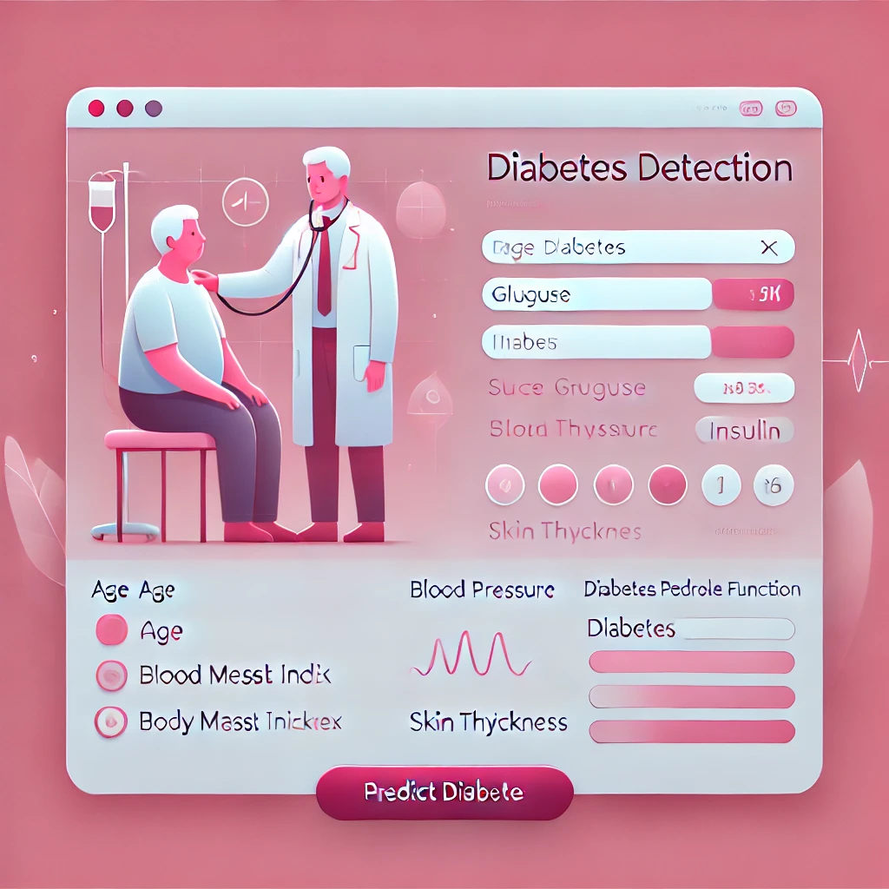
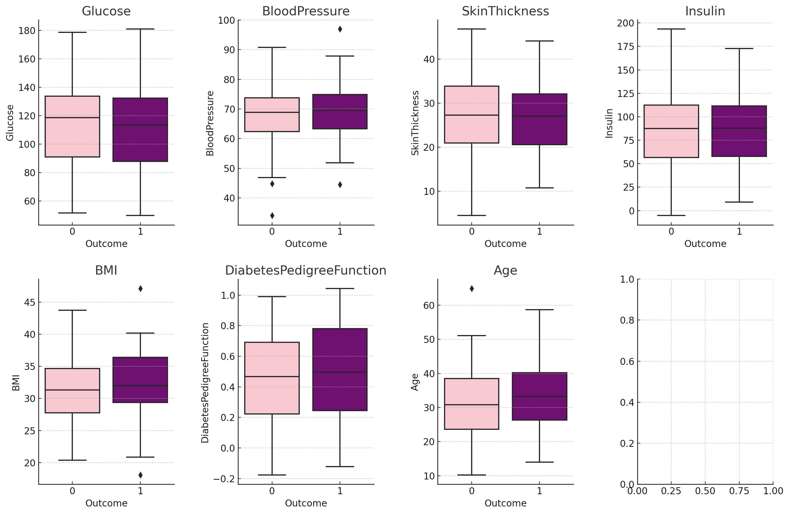
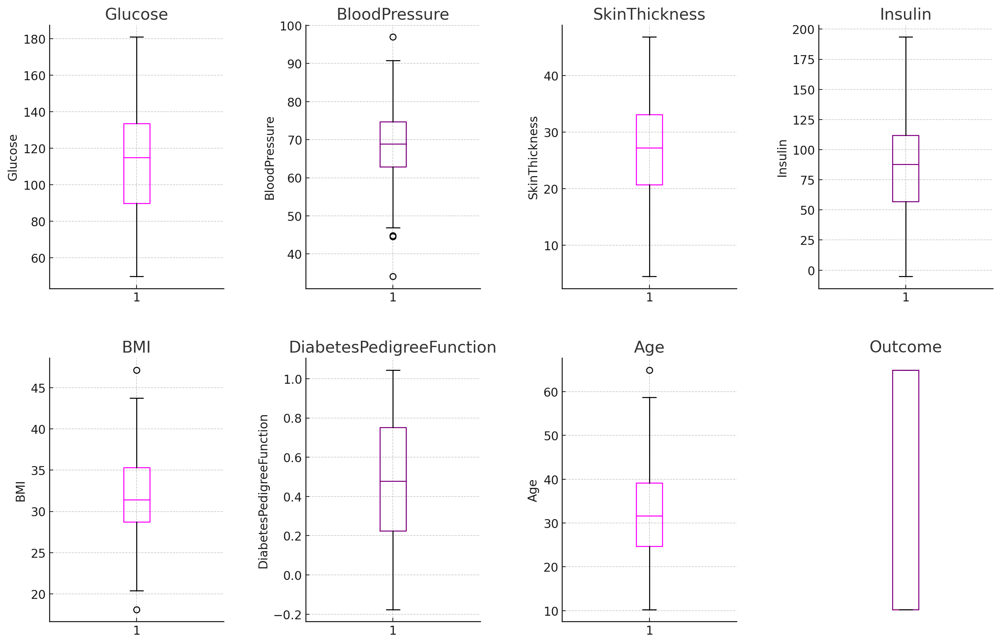
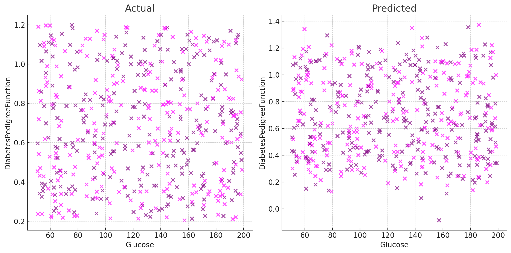
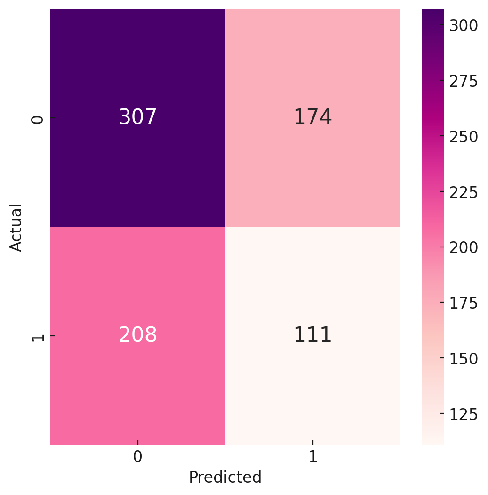

# Diabetes Prediction System Using Machine Learning

## Project Overview

This project utilizes machine learning to predict the likelihood of diabetes based on input features such as glucose levels, age, and blood pressure. The aim is to leverage historical data and advanced algorithms to provide accurate diabetes risk predictions. By training models on the data, we create a system capable of providing predictions for new individuals.



### Features and Objectives

This project aims to build a system that uses machine learning algorithms, statistical modeling, and past data to estimate an individual's probability of having diabetes. The focus is on using variables such as glucose levels, age, and blood pressure to determine diabetes risk. The model's goal is to enhance health decision-making by providing early indications of diabetes.

## Dataset Information

### About the Dataset

- **Source**: The dataset originates from the National Institute of Diabetes and Digestive and Kidney Diseases. The primary goal is to predict diabetes status based on several diagnostic metrics.
  
- **Dataset Context**: This dataset consists of health records of Pima Indian women aged at least 21 years.



### Data Features

1. **Pregnancies**: Number of pregnancies
2. **Glucose**: Plasma glucose concentration during an oral glucose tolerance test
3. **Blood Pressure**: Diastolic blood pressure (mm Hg)
4. **Skin Thickness**: Triceps skinfold thickness (mm)
5. **Insulin**: 2-hour serum insulin (mu U/ml)
6. **BMI**: Body mass index (weight in kg / height in m^2)
7. **Diabetes Pedigree Function**: Diabetes pedigree function
8. **Age**: Age in years
9. **Outcome**: Class variable indicating diabetes (0 or 1)

## Feature Engineering

### Selecting Relevant Features

The process of **feature selection** is essential to identifying the most relevant variables, improving model performance, reducing overfitting, and enhancing interpretability. Methods used for feature selection include:

- **Correlation Matrix**: Identifying highly correlated features to determine which should be retained or removed to prevent multicollinearity.
- **Heat Maps**: Used to visualize correlations among features.

### Handling Outliers

**Outliers** can significantly distort model predictions and analysis accuracy. This project includes methods to handle outliers effectively:

- **Visualization**: Outliers are identified using box plots, scatter plots, and histograms.
- **Interquartile Range (IQR)**: Calculating IQR helps detect outliers based on their distance from the lower and upper quartiles.

Methods for addressing outliers include imputing outlier values with measures like **mean**, **median**, or **mode**.


## Feature Transformation and Scaling

To prepare features for modeling, several transformation techniques are employed:

- **Label Encoding**: Converts categorical variables into numeric values.
- **Target Encoding**: Encodes categorical variables using the average value of the target variable.
- **Feature Scaling**: Uses the **StandardScaler** to standardize features to a similar scale, ensuring they have zero mean and unit variance.

## Model Building

### Machine Learning Models Used

The project employs multiple machine learning algorithms to predict diabetes status:

- **Logistic Regression**: For binary classification, predicting diabetes presence or absence.
- **Naive Bayes Classifier**: Uses probabilistic modeling to classify data.
- **K-Nearest Neighbors (KNN)**: Assigns class labels based on the nearest neighbors in feature space.
- **Decision Tree Classifier**: Recursively splits data to make predictions based on feature values.
- **Support Vector Classifier (SVC)**: Uses hyperplane optimization to classify data.

### Model Evaluation

- **Confusion Matrix**: Evaluates model performance by displaying predictions against actual classes, highlighting correct classifications and types of errors.



#### Model Accuracy

- **Logistic Regression**: 80.53%
- **Naive Bayes**: 77.09%
- **K-Nearest Neighbors**: 73.66%
- **Decision Tree Classifier**: 74.04%
- **Support Vector Classifier**: 79.77%

Based on evaluation, **Logistic Regression** was selected as the primary model due to its superior accuracy in predicting diabetes.

## Hyperparameter Tuning

To optimize model performance, **grid search** was employed to determine the best set of hyperparameters:

- **Solvers**: ['newton-cg', 'lbfgs', 'liblinear']
- **Penalty**: ['l2']
- **C Values**: [100, 10, 1.0, 0.1, 0.01]



Post-tuning, the **Logistic Regression** model provided better results and was selected as the final model.

# Diabetes Detection App

This guide helps you set up and run the Diabetes Detection App on your local machine.

---

## Clone the Repository

To download the Diabetes Detection project, clone the repository using the following command:

```bash
git clone https://github.com/daumittal/Diabetes-Prediction.git
```

## Install Dependencies

After cloning the repository, install the required packages specified in the `requirements.txt` file:

```bash
pip install -r requirements.txt
```
## Setting Up a Virtual Environment

It is recommended to use a virtual environment to avoid conflicts with other projects. Follow these steps:

### Using virtualenv

**Install virtualenv (if not installed):**

```bash
pip install virtualenv
```
**Create a new virtual environment:**

```bash
virtualenv myenv
```

**Activate the virtual environment:**

_On macOS/Linux:_

```bash
source myenv/bin/activate
```

_On Windows:_

```bash
myenv\Scripts\activate
```

**Install the dependencies:**

```bash
pip install -r requirements.txt
```

## Using conda

**Create a new conda environment:**

```bash
conda create --name myenv
```
**Activate the environment:**

```bash
conda activate myenv
```

**Install the dependencies:**

```bash
pip install -r requirements.txt
```

## Launching Jupyter Notebook or Lab

You can specify the notebook file location or the working directory when launching Jupyter Notebook or Lab:

**Open Jupyter Notebook:**

```bash
jupyter notebook /path/to/notebook/directory
```

**Open Jupyter Lab:**

```bash
jupyter lab /path/to/notebook/directory
```

## Setting Up the Flask App for Diabetes Detection

### Step 1: Create a Project Directory

Create a new directory for your project and navigate to it:

```bash
mkdir myproject
cd myproject
```
### Step 2: Set Up a Virtual Environment

Use one of the following methods to create and activate a virtual environment:

**Using virtualenv:**

```bash
virtualenv venv
source venv/bin/activate
```

**Using conda:**

```bash
conda create --name myenv
conda activate myenv
```


### Step 3: Install Flask and Dependencies

Install Flask and any other required dependencies:

```bash
pip install flask
pip install -r requirements.txt
```

### Step 4: Create the Flask Application

Create a new file named `app.py` or `main.py` in the project directory:

```bash
touch app.py
```
In the app.py or main.py file, import Flask, create an instance of the Flask class, and define your routes and functions.

### Step 5: Run the Application

Run the application using one of the following commands:

```bash
flask run
```
or

```bash
python app.py
```

or

```bash
python main.py
```

The app will start, and you can access it in your web browser.


